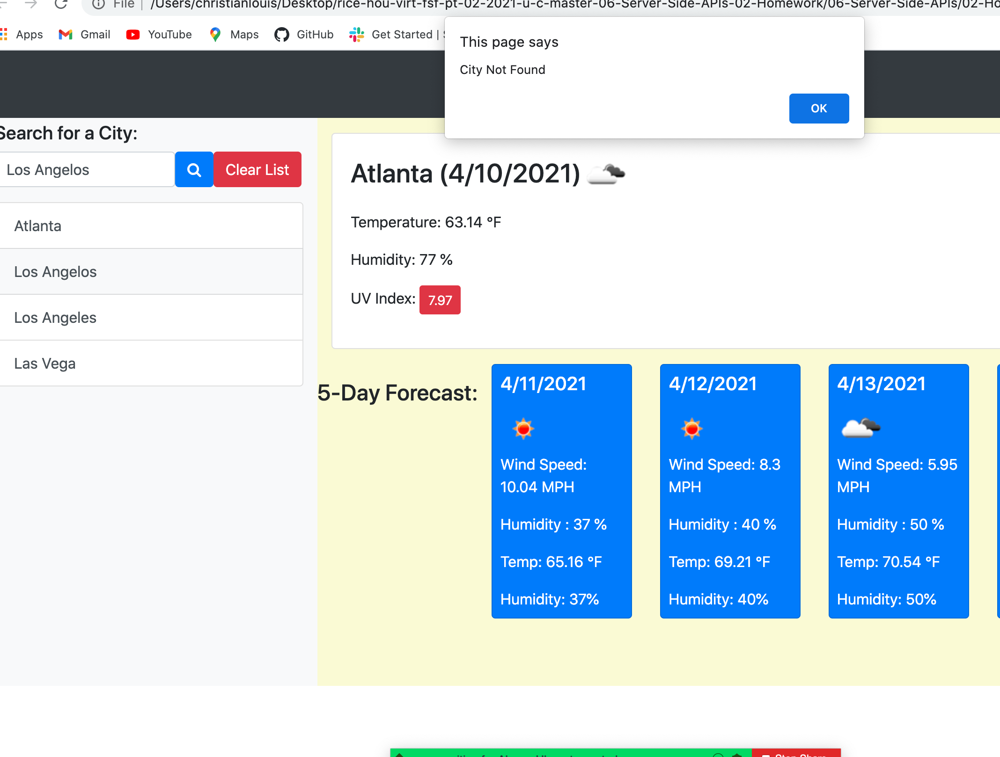
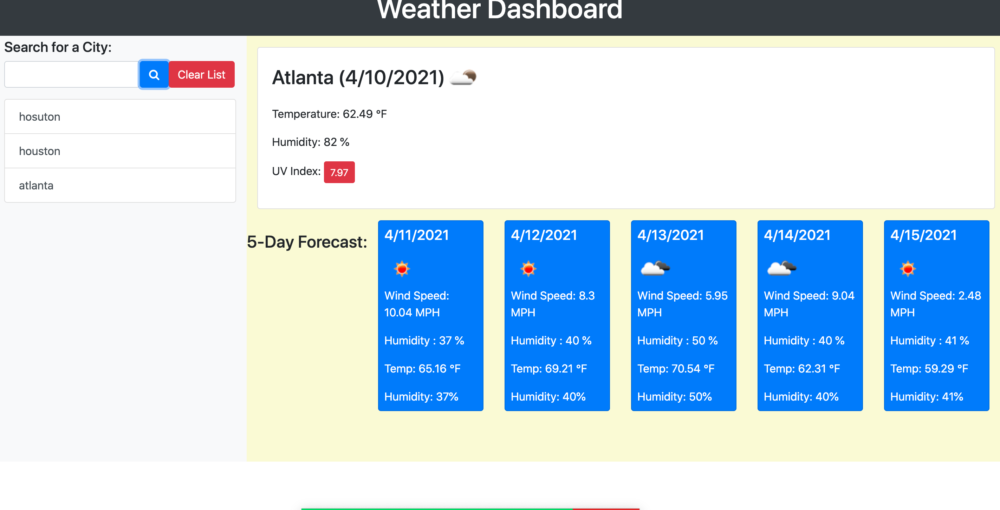
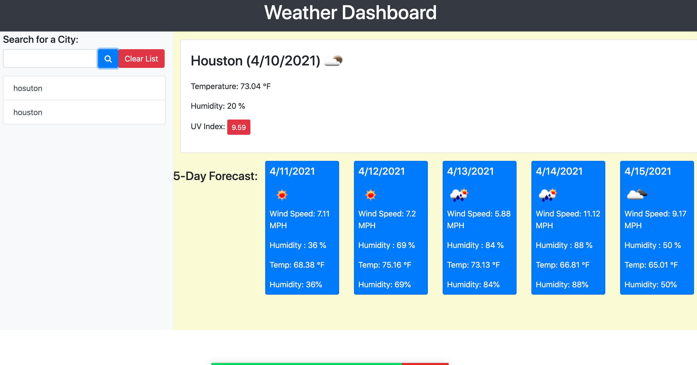
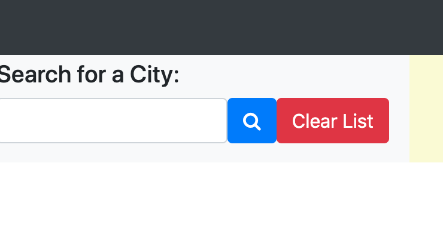

# Name Of Git Repository
CJL-Weather

## Description

The weather dashboard utilizes open weather API to pull weather forcast for user indicated cities.

A clear button was also added for user convenience to maintain cleanliness, enabling user to delete previous entries.

## Screenshots
API key for updated site:

[link to Deployed Application site!](https://clouis12.github.io/)

[link to GitHub URL !](https://github.com/Clouis12/CJL-Weather)

